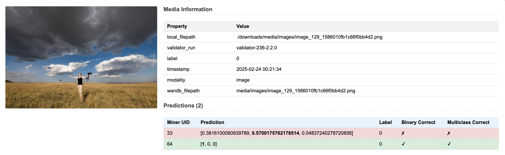

## Features

- **W&B Integration**: Fetch runs and metrics from Weights & Biases
- **Performance Analysis**: Compute comprehensive metrics including:
  - Multiclass accuracy, precision, recall, F1, MCC
  - Binary accuracy, precision, recall, F1, AUC, MCC
- **Media Management**: Download and organize challenge media (images/videos)
- **Visual Gallery**: Generate HTML galleries showing:
  - Challenge media
  - Predictions from multiple miners
  - Performance metrics and metadata
  - Color-coded correctness indicators

## File Structure

- `wandb_explore.ipynb`: Main notebook with examples and usage
- `data.py`: Core functions for data fetching and processing
- `metrics.py`: Performance metric calculations
- `media_gallery.py`: HTML gallery generation
- `requirements.txt`: Project dependencies

## Output Files

The tools generate several output files:
- `miner_predictions.csv`: Detailed prediction data
- `miner_performance.csv`: Aggregated performance metrics
- `media_gallery.html`: Visual gallery of challenge media and predictions
- Downloaded media files in the specified download directory

## Screenshots

<p align="center">
  
  <br>
  <em>Example media gallery</em>
</p>


## License
This repository is licensed under the MIT License.
```text
# The MIT License (MIT)
# Copyright © 2023 Yuma Rao

# Permission is hereby granted, free of charge, to any person obtaining a copy of this software and associated
# documentation files (the “Software”), to deal in the Software without restriction, including without limitation
# the rights to use, copy, modify, merge, publish, distribute, sublicense, and/or sell copies of the Software,
# and to permit persons to whom the Software is furnished to do so, subject to the following conditions:

# The above copyright notice and this permission notice shall be included in all copies or substantial portions of
# the Software.

# THE SOFTWARE IS PROVIDED “AS IS”, WITHOUT WARRANTY OF ANY KIND, EXPRESS OR IMPLIED, INCLUDING BUT NOT LIMITED TO
# THE WARRANTIES OF MERCHANTABILITY, FITNESS FOR A PARTICULAR PURPOSE AND NONINFRINGEMENT. IN NO EVENT SHALL
# THE AUTHORS OR COPYRIGHT HOLDERS BE LIABLE FOR ANY CLAIM, DAMAGES OR OTHER LIABILITY, WHETHER IN AN ACTION
# OF CONTRACT, TORT OR OTHERWISE, ARISING FROM, OUT OF OR IN CONNECTION WITH THE SOFTWARE OR THE USE OR OTHER
# DEALINGS IN THE SOFTWARE.
```
